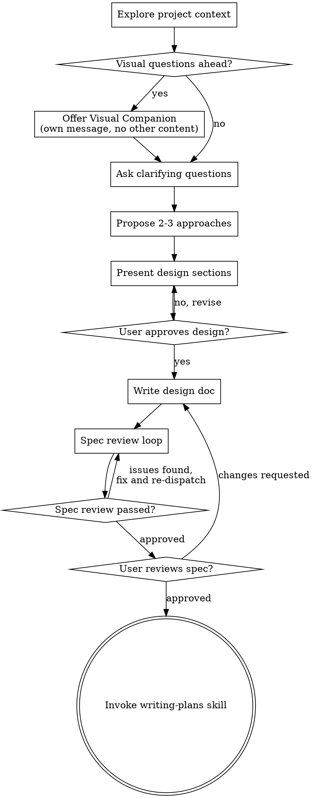

# 把想法梳理成设计

通过自然、协作式对话，把想法打磨成完整设计和 spec。

先理解当前项目上下文，然后一次只问一个问题，不断收敛想法。只有在你真正理解要构建什么之后，才能给出设计并获得用户批准。

<HARD-GATE>
在你展示设计并得到用户批准之前，**不要**调用任何实现类 skill，不要写代码，不要脚手架项目，也不要采取任何实现动作。不论项目看起来多简单，这条规则都成立。
</HARD-GATE>

## 反模式：“这太简单，不需要设计”

每个项目都必须经过这个过程。todo list、单函数工具、配置改动——全部一样。越“简单”的项目，越容易因为未经检查的假设而浪费时间。设计可以很短（对极简单项目，几句话也行），但你**必须**先展示设计并获得批准。

## 检查清单

你**必须**为下列每一项创建任务，并按顺序完成：

1. **探索项目上下文** —— 查看文件、文档、最近提交
2. **提供 visual companion**（如果后续问题涉及视觉内容）—— 这一项必须单独发一条消息，不能和澄清问题混在一起。见下文 Visual Companion
3. **提出澄清问题** —— 一次一个，弄清目的、约束、成功标准
4. **提出 2-3 种方案** —— 给出权衡和你的推荐
5. **展示设计** —— 根据复杂度拆成多个部分展示，每个部分都先获得用户确认
6. **写设计文档** —— 保存到 `docs/superpowers/specs/YYYY-MM-DD-<topic>-design.md` 并提交
7. **Spec 评审循环** —— 派发 spec-document-reviewer subagent，只给精心构造的评审上下文（绝不传会话历史）；根据反馈修复并重新评审，直到通过（最多 3 轮，超过则交给人类）
8. **用户审阅已写出的 spec** —— 开始实现前，请用户先看 spec 文件
9. **切换到实现阶段** —— 调用 writing-plans skill 生成实现计划

## 流程图

**终态只能是调用 writing-plans。** 不要在 brainstorming 之后调用 frontend-design、mcp-builder 或其他实现类 skill。后续唯一允许调用的 skill 是 writing-plans。

## 具体过程

**理解想法：**

- 先查看项目当前状态（文件、文档、最近提交）
- 在提详细问题前先判断范围：如果请求描述了多个相互独立的子系统（例如“做一个带聊天、文件存储、计费和分析的平台”），立刻指出这一点。不要在一个需要先拆解的项目上继续细化问题。
- 如果项目大到不适合写成单个 spec，就帮助用户拆成多个子项目：这些部分如何独立、彼此关系是什么、应该先做哪个。然后只对第一个子项目走完整 brainstorm 流程。每个子项目都应经历 spec -> plan -> implementation。
- 对范围合适的项目，一次只问一个问题，逐步澄清
- 可以优先用多选题，但开放题也可以
- 一条消息只问一个问题；如果某个主题需要深入，就拆成多轮
- 重点理解：目的、约束、成功标准

**探索方案：**

- 提出 2-3 条不同路径并说明权衡
- 用对话式方式展示选项，同时给出你的推荐和原因
- 先讲推荐方案，再解释为什么推荐它

**展示设计：**

- 当你认为自己已经理解要构建什么时，再展示设计
- 每一部分的篇幅按复杂度调整：简单时几句话即可，复杂时可到 200-300 词
- 每展示一部分，都问用户“目前这样是否对”
- 应覆盖：架构、组件、数据流、错误处理、测试
- 如果哪里不清楚，要准备回头继续澄清

**为隔离性和清晰度而设计：**

- 把系统拆成更小的单元，每个单元只做一件事，通过清晰接口协作，并能独立理解、独立测试
- 对每个单元，都应能回答：它做什么、如何使用、依赖什么
- 如果别人不读实现细节就无法理解它，或内部一改就会影响调用方，说明边界有问题
- 更小、边界更清晰的单元也更适合 AI 工作：你更容易在上下文中 hold 住它，编辑也更可靠。文件一旦过大，通常说明它做得太多了。

**在现有代码库里工作：**

- 提议改动前先探索当前结构，遵循现有模式
- 如果现有代码的问题确实会影响当前工作（比如文件太大、边界混乱、职责缠绕），可以把有针对性的改进纳入设计
- 不要提出无关重构。始终围绕当前目标。

## 设计完成之后

**文档化：**

- 把确认后的设计写入 `docs/superpowers/specs/YYYY-MM-DD-<topic>-design.md`
  - 如果用户指定了别的位置，以用户偏好为准
- 如果可用，使用 `elements-of-style:writing-clearly-and-concisely` skill
- 把设计文档提交到 git

**Spec 评审循环：**
写完 spec 文档后：

1. 派发 spec-document-reviewer subagent（见 `spec-document-reviewer-prompt.md`）
2. 如果返回 Issues Found：修复，再次派发，直到 Approved
3. 如果循环超过 3 轮，升级给人类协作者处理

**用户审阅闸门：**
Spec 评审通过后，继续前先请用户审阅：

> "Spec written and committed to `<path>`. Please review it and let me know if you want to make any changes before we start writing out the implementation plan."

等待用户回复。如果用户要改动，就先改，并重新跑 spec review loop。只有用户明确批准后才能继续。

**进入实现：**

- 调用 writing-plans skill，生成详细实现计划
- 不要调用其他 skill。下一步只能是 writing-plans。

## 关键原则

- **一次只问一个问题** —— 不要一股脑扔很多问题
- **优先多选题** —— 通常比开放问题更容易回答
- **坚决贯彻 YAGNI** —— 把所有不必要的功能从设计里去掉
- **探索替代方案** —— 先提 2-3 个方案，再收敛
- **渐进式确认** —— 展示设计，先批准，再继续
- **保持灵活** —— 只要某处讲不通，就回去澄清

## Visual Companion

这是一个基于浏览器的辅助能力，可在 brainstorming 期间展示 mockup、图表和视觉方案。它是一个工具，而不是一种模式。用户同意后，表示后续**可以**在适合的场景里使用浏览器展示视觉内容；并不意味着每个问题都必须进浏览器。

**如何提供这个能力：** 如果你预期接下来会出现视觉内容问题（mockup、布局、图表），要单独发一条询问：

> "Some of what we're working on might be easier to explain if I can show it to you in a web browser. I can put together mockups, diagrams, comparisons, and other visuals as we go. This feature is still new and can be token-intensive. Want to try it? (Requires opening a local URL)"

**这条询问必须单独成消息。** 不要和澄清问题、上下文总结或其他任何内容混在一起。发完后先等用户回复。如果用户拒绝，就继续纯文本 brainstorming。

**每个问题都要重新判断：** 即便用户已经接受 visual companion，你仍然要对每个问题判断应该用浏览器还是终端。标准是：**用户看见它，会不会比只读文字更容易理解？**

- **用浏览器**：内容本身是视觉的——mockup、线框图、布局对比、架构图、视觉设计对照
- **用终端**：内容本身是文字的——需求问题、概念选择、权衡列表、A/B/C/D 文本选项、范围决策

只要话题和 UI 有关，并不自动意味着它是视觉问题。比如“这里的 personality 是什么意思？”是概念问题，应走终端；“哪个 wizard 布局更好？”是视觉问题，应走浏览器。

如果用户同意使用 visual companion，在继续前先阅读：
`skills/brainstorming/visual-companion.md`
