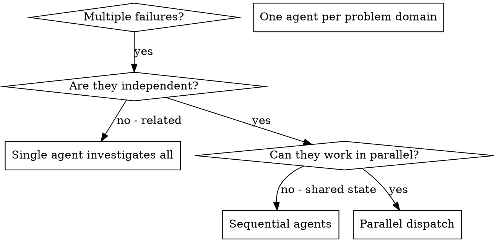

# 派发并行 Agents

## 概览

你会把任务委派给带隔离上下文的专用 agent。通过精确设计它们的指令和上下文，你可以让它们专注且高效地完成任务。它们**绝不应该**继承你的会话上下文或历史——你必须只给它们完成任务所需的信息。这也能把你自己的上下文保留下来，用于协调工作。

当你遇到多个互不相关的问题（不同测试文件、不同子系统、不同 bug）时，串行调查会很浪费时间。只要这些问题彼此独立，就应该并行处理。

**核心原则：**每个独立问题域派发一个 agent，让它们并发工作。

## 何时使用



**适用场景：**
- 3 个以上测试文件失败，且根因不同
- 多个子系统独立损坏
- 每个问题都能在不依赖其他问题上下文的情况下理解
- 调查之间没有共享状态

**不适用场景：**
- 失败彼此相关（修一个可能顺带修好其他）
- 必须先理解完整系统状态
- agents 之间会相互干扰

## 模式

### 1. 识别独立问题域

按“哪里坏了”分组：
- 文件 A 的测试：Tool approval flow
- 文件 B 的测试：Batch completion behavior
- 文件 C 的测试：Abort functionality

每个问题域相互独立——修 tool approval 不会影响 abort 测试。

### 2. 为每个 agent 创建聚焦任务

每个 agent 都应拿到：
- **明确范围：**一个测试文件或一个子系统
- **清晰目标：**让这些测试通过
- **清楚约束：**不要改别的代码
- **明确输出：**总结发现了什么、修了什么

### 3. 并行派发

```typescript
// In Claude Code / AI environment
Task("Fix agent-tool-abort.test.ts failures")
Task("Fix batch-completion-behavior.test.ts failures")
Task("Fix tool-approval-race-conditions.test.ts failures")
// All three run concurrently
```

### 4. 审阅与整合

当 agents 返回后：
- 阅读每份总结
- 确认修复之间没有冲突
- 运行完整测试套件
- 整合全部变更

## Agent Prompt 结构

好的 agent prompt 应具备：
1. **聚焦** —— 只处理一个明确问题域
2. **自包含** —— 提供理解问题所需的全部上下文
3. **输出明确** —— agent 最终应该返回什么

```markdown
Fix the 3 failing tests in src/agents/agent-tool-abort.test.ts:

1. "should abort tool with partial output capture" - expects 'interrupted at' in message
2. "should handle mixed completed and aborted tools" - fast tool aborted instead of completed
3. "should properly track pendingToolCount" - expects 3 results but gets 0

These are timing/race condition issues. Your task:

1. Read the test file and understand what each test verifies
2. Identify root cause - timing issues or actual bugs?
3. Fix by:
   - Replacing arbitrary timeouts with event-based waiting
   - Fixing bugs in abort implementation if found
   - Adjusting test expectations if testing changed behavior

Do NOT just increase timeouts - find the real issue.

Return: Summary of what you found and what you fixed.
```

## 常见错误

**❌ 过宽：**"Fix all the tests" —— agent 会迷失范围  
**✅ 聚焦：**"Fix agent-tool-abort.test.ts" —— 范围明确

**❌ 没上下文：**"Fix the race condition" —— agent 不知道在哪里  
**✅ 有上下文：**贴出报错信息和测试名

**❌ 没约束：**agent 可能顺手重构一切  
**✅ 有约束：**"Do NOT change production code" 或 "Fix tests only"

**❌ 输出模糊：**"Fix it" —— 你不知道改了什么  
**✅ 输出具体：**"Return summary of root cause and changes"

## 何时不要用

- **相关失败：**修一个可能一起修其他，先一起调查
- **需要完整上下文：**必须理解全系统才能判断
- **探索式调试：**你还不知道到底哪里坏了
- **共享状态：**agents 会互相干扰（改同一文件、共享同一资源）

## 会话中的真实案例

**场景：**一次大重构后，3 个文件里出现 6 个测试失败

**失败分布：**
- `agent-tool-abort.test.ts`：3 个失败（时间相关）
- `batch-completion-behavior.test.ts`：2 个失败（tools 没执行）
- `tool-approval-race-conditions.test.ts`：1 个失败（execution count = 0）

**判断：**独立问题域——abort 逻辑、batch completion、race condition 彼此分离

**派发：**
```
Agent 1 -> Fix agent-tool-abort.test.ts
Agent 2 -> Fix batch-completion-behavior.test.ts
Agent 3 -> Fix tool-approval-race-conditions.test.ts
```

**结果：**
- Agent 1：把 timeouts 换成 event-based waiting
- Agent 2：修复事件结构 bug（threadId 放错位置）
- Agent 3：增加等待，确保异步 tool execution 完成

**整合：**全部修复相互独立，没有冲突，完整测试套件转绿

**节省时间：**3 个问题并行解决，而不是串行逐个调查

## 关键收益

1. **并行化** —— 多个调查同时进行
2. **聚焦** —— 每个 agent 只跟踪很窄的范围
3. **独立性** —— agents 不会彼此干扰
4. **速度** —— 3 个问题几乎能压缩到 1 个问题的时间内解决

## 验证

当 agents 返回后：
1. **审阅每份总结** —— 确认到底改了什么
2. **检查冲突** —— 是否改到了同一片代码
3. **跑完整测试** —— 确认所有修复可以一起工作
4. **抽样核对** —— agent 也可能犯系统性错误

## 真实世界影响

来自一次调试会话（2025-10-03）：
- 3 个文件里一共 6 个失败
- 并行派发了 3 个 agents
- 所有调查同时完成
- 所有修复成功整合
- agents 的改动零冲突
