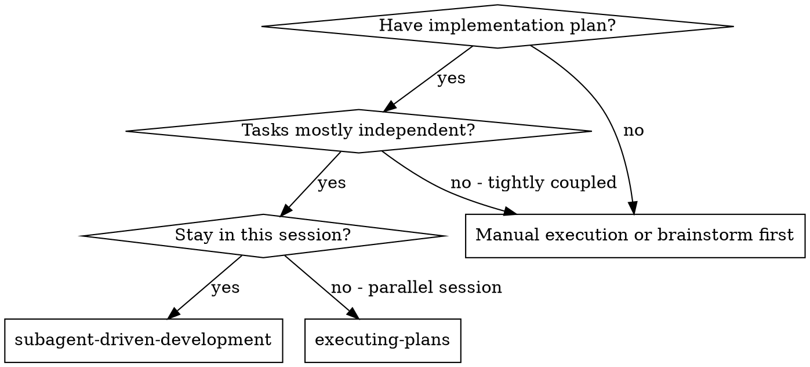
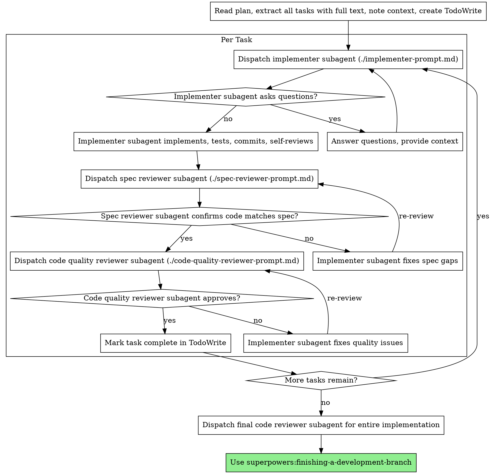

# Subagent 驱动开发

通过“每个任务派发一个全新 subagent”的方式执行计划，并在每个任务后进行两阶段评审：先做 spec compliance review，再做 code quality review。

**为什么用 subagent：**你把任务交给拥有隔离上下文的专用 agent。通过精确构造它们的指令和上下文，你能让它们保持聚焦并成功完成任务。它们绝不应继承你的会话历史——你必须只给它们真正需要的信息。这也能保留你自己的上下文用于协调工作。

**核心原则：**每个任务一个全新 subagent + 两阶段评审（spec 后 quality）= 高质量、快迭代

**持续执行：**不要在任务之间停下来向人类协作者反复确认。拿到计划后，应一口气执行完全部任务，除非出现你无法自行解决的 `BLOCKED`、真实阻碍推进的歧义，或所有任务已经完成。像“要不要继续？”这类确认和纯进度播报只会浪费对方时间；既然对方要求你执行计划，就直接执行。

## 何时使用



**与 Executing Plans 相比：**
- 同一会话内完成（无需切换上下文）
- 每个任务用全新 subagent（避免上下文污染）
- 每个任务后自动做两阶段评审：spec compliance -> code quality
- 迭代更快（任务间不必总让人类介入）

## 流程



## 模型选择

用“足够能完成任务的最低模型能力”来控制成本并提高速度。

**机械性实现任务**（隔离函数、规格清晰、只改 1-2 个文件）：用快且便宜的模型。

**集成与判断任务**（多文件协作、模式匹配、调试）：用标准模型。

**架构、设计和评审任务：**用当前可用的最强模型。

**复杂度信号：**
- 只改 1-2 个文件，且 spec 完整 -> 便宜模型
- 触及多个文件并有集成问题 -> 标准模型
- 需要架构判断或大范围代码库理解 -> 最强模型

## 处理 Implementer 状态

Implementer subagent 会返回四种状态：

**DONE：**进入 spec compliance review。

**DONE_WITH_CONCERNS：**工作完成了，但它提出了担忧。先读这些担忧；如果是正确性或范围问题，先处理再评审；如果只是观察（如“这个文件越来越大”），记录后继续评审。

**NEEDS_CONTEXT：**上下文不够。补充缺失信息后重新派发。

**BLOCKED：**它无法完成任务。此时要判断阻塞类型：
1. 如果是上下文问题，补充上下文后用同一模型重派
2. 如果任务需要更强推理能力，换更强模型重派
3. 如果任务太大，继续拆小
4. 如果计划本身错了，升级给人类协作者

**绝不要**忽略升级信号，也不要什么都不改就强行让同一模型重试。

## Prompt 模板

- `./implementer-prompt.md` - 派发 implementer subagent
- `./spec-reviewer-prompt.md` - 派发 spec compliance reviewer
- `./code-quality-reviewer-prompt.md` - 派发 code quality reviewer

## 示例工作流

```
You: I'm using Subagent-Driven Development to execute this plan.

[Read plan file once: docs/superpowers/plans/feature-plan.md]
[Extract all 5 tasks with full text and context]
[Create TodoWrite with all tasks]

Task 1: Hook installation script

[Get Task 1 text and context (already extracted)]
[Dispatch implementation subagent with full task text + context]

Implementer: "Before I begin - should the hook be installed at user or system level?"

You: "User level (~/.config/superpowers/hooks/)"

Implementer: "Got it. Implementing now..."
[Later] Implementer:
  - Implemented install-hook command
  - Added tests, 5/5 passing
  - Self-review: Found I missed --force flag, added it
  - Committed

[Dispatch spec compliance reviewer]
Spec reviewer: ✅ Spec compliant - all requirements met, nothing extra

[Get git SHAs, dispatch code quality reviewer]
Code reviewer: Strengths: Good test coverage, clean. Issues: None. Approved.

[Mark Task 1 complete]
```

## 优势

**相对手工执行：**
- subagent 更自然地遵循 TDD
- 每个任务都是 fresh context
- 并行安全（subagents 不互相污染）
- subagent 可以在工作前和过程中提问

**相对 Executing Plans：**
- 同一会话内推进
- 持续进展，无需等待长 handoff
- review 检查点自动化

**效率收益：**
- 控制器直接提供完整任务文本，无需反复读文件
- 只提供真正需要的上下文
- 问题会在动手前暴露，而不是事后

**质量闸门：**
- implementer 的 self-review 会先挡住一批问题
- 双阶段评审：先 spec compliance，再 code quality
- review loop 确保问题真被修掉
- spec compliance 防止 overbuild / underbuild
- code quality 保证实现本身可靠

**成本：**
- 每个任务需要更多 subagent 调用（实现者 + 两个 reviewer）
- 控制器要做更多准备工作（先抽出所有任务）
- review loop 会增加迭代
- 但能更早发现问题，通常比后面返工更便宜

## 红旗

**绝不要：**
- 未经用户明确同意就在 `main`/`master` 上开始实现
- 跳过评审（无论 spec compliance 还是 code quality）
- 带着未修复问题进入下一个任务
- 并行派发多个实现 subagent（会冲突）
- 让 subagent 自己去读 plan 文件（你应该直接给完整文本）
- 跳过场景铺垫上下文
- 忽略 subagent 的问题
- 在 spec reviewer 发现问题时还说“差不多可以了”
- 跳过 re-review
- 用 implementer 的 self-review 替代正式 review
- **在 spec compliance 没有 ✅ 前就做 code quality review**
- 任一 review 仍有 open issue 时就进入下一个任务

## 集成关系

**必需的 workflow skills：**
- **superpowers:using-git-worktrees** - 确保存在隔离工作区（创建新的，或确认当前已隔离）
- **superpowers:writing-plans** - 生成要执行的计划
- **superpowers:requesting-code-review** - 为 reviewer subagent 提供 review 模板
- **superpowers:finishing-a-development-branch** - 所有任务完成后的开发收尾

**Subagents 应使用：**
- **superpowers:test-driven-development** - 每个任务都按 TDD 执行

**替代 workflow：**
- **superpowers:executing-plans** - 如果要在独立会话里执行，而不是当前会话，就用它
