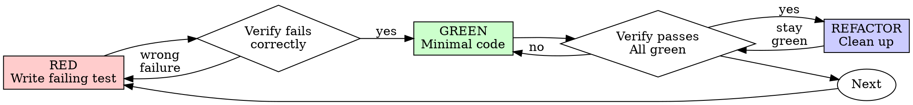

# 测试驱动开发（TDD）

## 概览

先写测试。看它失败。再写最小代码让它通过。

**核心原则：**如果你没亲眼看到测试失败，你就不知道这个测试是否真的在测试正确的东西。

**违背规则的字面要求，就是违背规则的精神。**

## 何时使用

**始终使用：**
- 新功能
- Bug 修复
- 重构
- 行为变化

**例外（先问人类协作者）：**
- 一次性原型
- 生成代码
- 配置文件

只要你脑中出现“这次先跳过 TDD”，就说明你在合理化。

## 铁律

```
NO PRODUCTION CODE WITHOUT A FAILING TEST FIRST
```

先写代码、后补测试？删掉，重来。

**没有例外：**
- 不要把先写的代码留作“参考”
- 不要一边写测试一边“改造”它
- 不要看着那段先写的代码继续写
- Delete means delete

必须从测试重新出发实现。就这样。

## 红-绿-重构



### RED - 写失败测试

只写一个最小测试，表达“应该发生什么”。

<Good>
```typescript
test('retries failed operations 3 times', async () => {
  let attempts = 0;
  const operation = () => {
    attempts++;
    if (attempts < 3) throw new Error('fail');
    return 'success';
  };

  const result = await retryOperation(operation);

  expect(result).toBe('success');
  expect(attempts).toBe(3);
});
```
测试名清晰，测真实行为，只测一件事
</Good>

<Bad>
```typescript
test('retry works', async () => {
  const mock = jest.fn()
    .mockRejectedValueOnce(new Error())
    .mockRejectedValueOnce(new Error())
    .mockResolvedValueOnce('success');
  await retryOperation(mock);
  expect(mock).toHaveBeenCalledTimes(3);
});
```
名字模糊，测的是 mock，不是代码行为
</Bad>

**要求：**
- 只测一个行为
- 名字清楚
- 尽量测真实代码（除非不得不 mock）

### 验证 RED - 亲眼看到它失败

**强制要求，绝不跳过。**

```bash
npm test path/to/test.test.ts
```

确认：
- 测试是失败（fail），不是报错（error）
- 失败信息符合预期
- 失败原因是“功能缺失”，而不是拼写或其他低级错误

**测试直接通过？** 说明你在测已存在行为，去修测试。  
**测试报错？** 先修错误，直到它以正确原因失败。

### GREEN - 写最小实现

写出**刚好**能让测试通过的代码。

<Good>
```typescript
async function retryOperation<T>(fn: () => Promise<T>): Promise<T> {
  for (let i = 0; i < 3; i++) {
    try {
      return await fn();
    } catch (e) {
      if (i === 2) throw e;
    }
  }
  throw new Error('unreachable');
}
```
只做刚好够通过的实现
</Good>

<Bad>
```typescript
async function retryOperation<T>(
  fn: () => Promise<T>,
  options?: {
    maxRetries?: number;
    backoff?: 'linear' | 'exponential';
    onRetry?: (attempt: number) => void;
  }
): Promise<T> {
  // YAGNI
}
```
过度设计
</Bad>

不要加额外功能，不要顺手重构，不要做“顺便优化”。

### 验证 GREEN - 亲眼看到它通过

**强制要求。**

```bash
npm test path/to/test.test.ts
```

确认：
- 该测试通过
- 其他测试仍然通过
- 输出干净（没有新的 warning / error）

### REFACTOR - 清理

只有在绿灯之后才能做：
- 去重
- 改好名字
- 提取 helper

清理过程中必须保持测试一直是绿的。不要新增行为。

### Repeat

下一个功能，就从下一个失败测试开始。

## 好测试的特征

| Quality | Good | Bad |
|---------|------|-----|
| **Minimal** | 只测一件事 | 一个测试里堆很多行为 |
| **Clear** | 名称描述行为 | `test('test1')` |
| **Shows intent** | 能体现期望 API | 把意图藏起来 |

## 为什么顺序重要

**“我可以先写实现，之后补测试”**

事后写的测试通常一上来就是绿的，而“直接变绿”证明不了任何事情：
- 你可能测错了对象
- 你可能测的是实现细节，而不是需求行为
- 你可能遗漏边界条件
- 你从没验证过测试能抓到 bug

测试先行会逼你亲眼看到它红，从而证明这个测试真的能抓到问题。

**“我已经手动测过边界情况了”**

手测是临时性的：
- 没有记录
- 代码一改你得重测
- 压力下很容易漏测
- “我试过能行” 不等于系统性验证

自动化测试才是可以重复运行、可回归的证据。

**“删掉我写了几个小时的代码太浪费”**

这是 sunk cost fallacy。时间已经花掉了。你现在的选择只有：
- 删掉，按 TDD 重写（成本明确，信心高）
- 留着，再补测试（表面快，实则低信心，后面容易出 bug）

真正浪费的是把不可信代码继续留在系统里。

## 常见合理化借口

| Excuse | Reality |
|--------|---------|
| "Too simple to test" | 越简单的代码越应该顺手补一个测试，成本很低。 |
| "I'll test after" | 事后测试直接变绿，证明不了它会抓 bug。 |
| "Tests after achieve same goals" | 事后测试回答“它现在做了什么”；测试先行回答“它应该做什么”。 |
| "Already manually tested" | 手测不可回放，也不系统。 |
| "Deleting X hours is wasteful" | 沉没成本不是理由。保留不可信代码才是浪费。 |
| "Keep as reference, write tests first" | 你一定会不自觉照着它改，这仍然是测试滞后。 |
| "Need to explore first" | 可以先探索，但探索代码必须扔掉，再回到 TDD。 |
| "Test hard = design unclear" | 测起来困难，通常说明设计本身不好。 |
| "TDD will slow me down" | TDD 比事后调试更快。 |
| "Existing code has no tests" | 这正是你改善它的机会。 |

## 红旗 - 一旦出现就重来

- 先写代码，再写测试
- 测试是在实现完成后补的
- 测试第一次跑就直接通过
- 你说不清测试为什么会失败
- 你想着“这次先跳过”
- 你说“我已经手测过了”
- 你说“事后测试精神上一样”
- 你想把先写的代码当参考
- 你说“已经写了太久，删了可惜”
- 你说“TDD 太教条，我要灵活一点”

**出现任何一条，都说明该删代码并重来。**

## Bug 修复示例

**Bug：**空邮箱被接受

**RED**
```typescript
test('rejects empty email', async () => {
  const result = await submitForm({ email: '' });
  expect(result.error).toBe('Email required');
});
```

**验证 RED**
```bash
$ npm test
FAIL: expected 'Email required', got undefined
```

**GREEN**
```typescript
function submitForm(data: FormData) {
  if (!data.email?.trim()) {
    return { error: 'Email required' };
  }
  // ...
}
```

**验证 GREEN**
```bash
$ npm test
PASS
```

**REFACTOR**
如果多个字段都要类似校验，再提取公共逻辑。

## 验证清单

完成前确认：
- [ ] 每个新函数 / 新方法都有测试
- [ ] 每个测试在实现前都亲眼看过失败
- [ ] 每个测试都因正确原因失败，而不是 typo
- [ ] 每次只写最小实现让测试通过
- [ ] 所有测试通过
- [ ] 输出干净，没有多余 warning / error
- [ ] 测试尽量测真实代码
- [ ] 覆盖了边界和错误场景

如果你不能全部打勾，说明你没有真正做 TDD。

## 卡住时怎么办

| Problem | Solution |
|---------|----------|
| 不知道怎么测 | 先写你希望出现的 API，再写断言。必要时问人类协作者。 |
| 测试太复杂 | 说明设计太复杂，先简化接口。 |
| 必须 mock 一切 | 说明代码耦合太高，考虑依赖注入。 |
| 测试准备太重 | 提取 helper；如果还很重，继续简化设计。 |

## 与调试的关系

发现 bug？先写一个能稳定复现它的失败测试，再走 TDD 循环。这样测试既能证明修复有效，也能防止回归。

**不要在没有测试的情况下修 bug。**

## 测试反模式

当你开始添加 mocks 或测试工具时，先读 `@testing-anti-patterns.md`，避免：
- 测 mock 行为，而不是测真实行为
- 为了测试给生产代码加测试专用方法
- 在没理解依赖的前提下乱 mock

## 最终规则

```
Production code -> test exists and failed first
Otherwise -> not TDD
```

除非人类协作者明确允许，否则没有例外。
