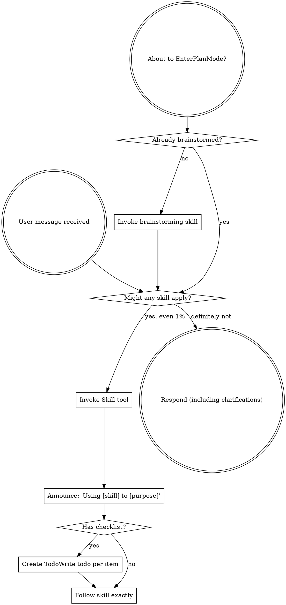

<SUBAGENT-STOP>
如果你是被派发出来执行某个具体任务的 subagent，跳过本 skill。
</SUBAGENT-STOP>

<EXTREMELY-IMPORTANT>
如果你觉得某个 skill 适用于当前任务的概率哪怕只有 1%，你也**绝对必须**先调用该 skill。

只要某个 skill 适用于当前任务，你就没有选择权，**必须使用它**。

这不是可协商项，也不是可选项。你不能靠“合理化”绕开它。
</EXTREMELY-IMPORTANT>

## 指令优先级

Superpowers skills 会覆盖默认 system prompt 的行为，但**用户指令永远优先**：

1. **用户的明确指令**（`CLAUDE.md`、`GEMINI.md`、`AGENTS.md`、直接请求）——最高优先级
2. **Superpowers skills** ——在冲突处覆盖默认系统行为
3. **默认 system prompt** ——最低优先级

如果 `CLAUDE.md`、`GEMINI.md` 或 `AGENTS.md` 写着“不要用 TDD”，而某个 skill 写着“始终使用 TDD”，那就遵循用户指令。控制权在用户手里。

## 如何访问 Skills

**在 Claude Code 中：**使用 `Skill` 工具。调用后会加载 skill 的正文内容，并直接按其要求执行。不要用 Read 工具去读 skill 文件。

**在 Copilot CLI 中：**使用 `skill` 工具。已安装插件中的 skills 会被自动发现，使用方式与 Claude Code 的 `Skill` 工具基本一致。

**在 Gemini CLI 中：**通过 `activate_skill` 工具激活。Gemini 会在会话开始时加载 skill 元数据，并在需要时按需激活完整内容。

**在其他环境中：**查看对应平台文档，确认该平台如何加载 skills。

## 平台适配

skills 里的工具名称以 Claude Code 为基准。非 Claude Code 平台请参考 `references/copilot-tools.md`（Copilot CLI）与 `references/codex-tools.md`（Codex）的工具映射。Gemini CLI 用户会通过 `GEMINI.md` 自动拿到工具映射。

# 使用 Skills

## 规则

**任何响应或行动之前，先调用相关或被请求的 skill。** 哪怕只有 1% 的可能性适用，也要先调用 skill 检查。只有在调用后确认它其实不适用时，你才可以不用它。

## 红旗

出现下面这些念头时，立刻停下——你正在合理化：

| Thought | Reality |
|---------|---------|
| "This is just a simple question" | 问题也是任务。先检查 skill。 |
| "I need more context first" | skill 检查必须发生在澄清问题之前。 |
| "Let me explore the codebase first" | skill 会告诉你**怎么**探索。先检查。 |
| "I can check git/files quickly" | 文件本身不包含对话上下文。先检查 skill。 |
| "Let me gather information first" | skill 会告诉你**怎么**收集信息。 |
| "This doesn't need a formal skill" | 只要 skill 存在，就要用。 |
| "I remember this skill" | skill 会演化。读当前版本。 |
| "This doesn't count as a task" | 只要有动作，就是任务。先检查。 |
| "The skill is overkill" | 简单事也会变复杂。先用它。 |
| "I'll just do this one thing first" | 做任何事之前都要先检查。 |
| "This feels productive" | 无纪律的动作只会浪费时间。skill 就是拿来防这个的。 |
| "I know what that means" | 知道概念 ≠ 真正使用了 skill。去调用它。 |

## Skill 优先级

当多个 skill 都可能适用时，按下面顺序：

1. **先用流程类 skills**（如 `brainstorming`、`debugging`）——它们决定你应该**如何**处理任务
2. **再用实现类 skills**（如 `frontend-design`、`mcp-builder`）——它们指导你具体执行

“Let’s build X” → 先 `brainstorming`，再实现类 skill。  
“Fix this bug” → 先 `debugging`，再领域相关 skill。

## Skill 类型

**Rigid**（如 TDD、debugging）：必须原样遵循，不要把纪律性要求“适配掉”。

**Flexible**（如 pattern 类）：按上下文调整原则。

具体以 skill 本身的说明为准。

## 用户指令

指令描述的是 **WHAT**，不是 **HOW**。用户说“Add X”或“Fix Y”，并不等于可以跳过这些工作流。
